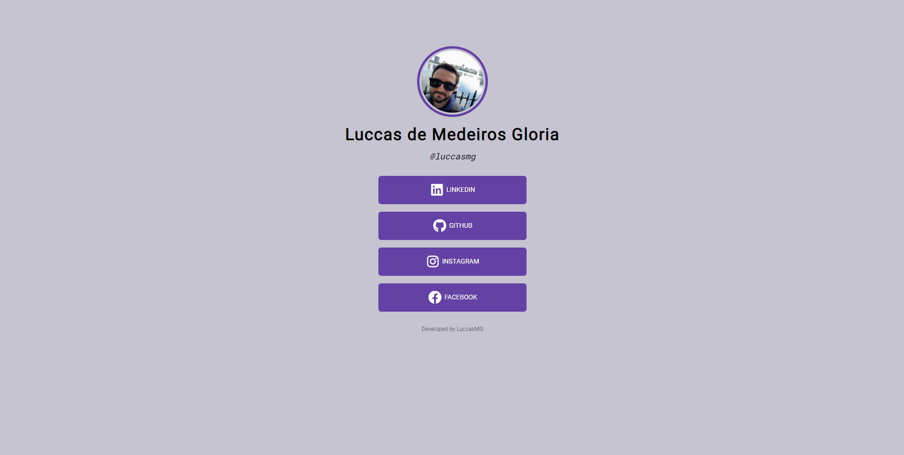

# Projeto RocketLinks

   

<h4 align="center">✔️ <strong>Projeto Concluído</strong> 🚀</h4>

## 📋 Sobre o Projeto

O projeto foi desenvolvido durante a Maratona Explorer 2.0 2022 da Rocketseat com o objetivo desenvolver um website de social-linking e redes sociais, inspirado no modelo de plataforma do Linktree. Foram utilizadas as linguagens HTML e CSS.

## 💻 Demonstração

Você pode acessar a <a href="https://luccasmg.github.io/rocketlinks/" target="_blank">versão final do projeto</a>.

## ✏️ Autor

| [ Luccas de Medeiros Gloria](https://github.com/luccasmg) |
| :---: |

## ✅ Licença

<a href="LICENSE.txt">MIT License</a>
